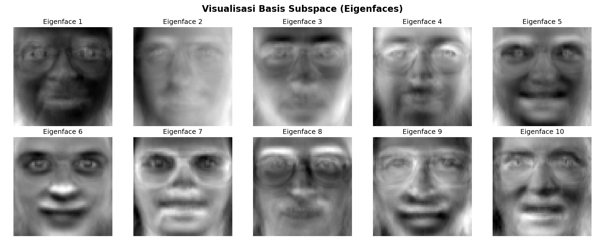
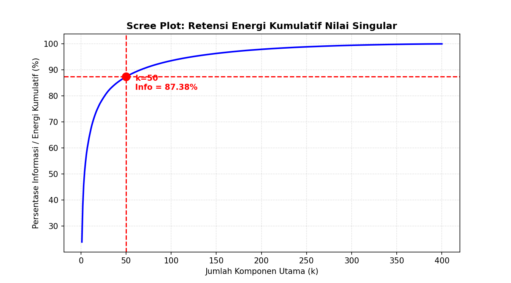

# Pengenalan Wajah: Eigenfaces Berbasis SVD

Pernah terpikir bagaimana komputer bisa mengenali wajah manusia? Di bab ini, kita akan membahas cara kerja algoritma **Eigenfaces** dengan memanfaatkan metode dekomposisi matriks **Singular Value Decomposition (SVD)**. Kita akan membedah teori aljabar linearnya, langkah-langkah pemrogramannya, hingga menguji sistem dengan mendeteksi wajah baru dari dataset.

---

## 1. Konsep Dasar SVD pada Wajah

Dalam aljabar linear, setiap matriks data $A$ berukuran $M \times N$ bisa dipecah (difaktorkan) menjadi perkalian tiga matriks:

$$A = U \Sigma V^T$$

Agar lebih mudah dibayangkan, mari kita terjemahkan matriks-matriks matematika di atas ke dalam objek nyata di sistem pengenal wajah kita:

* **Matriks $A$ (Matriks Data Wajah):** Berukuran $4096 \times 400$. Setiap kolom di matriks ini adalah satu foto wajah yang sudah diratakan (*flattened*) menjadi vektor kolom panjang dan dikurangi dengan wajah rata-rata agar menyisakan fitur uniknya saja.
* **Matriks $U$ (Left Singular Vectors / Eigenfaces):** Berukuran $4096 \times 400$ (menggunakan *Economy SVD*). Kolom-kolom di matriks inilah yang kita sebut sebagai **Eigenfaces** (wajah hantu). Matriks ini menyimpan arah variasi bentuk wajah terbesar seperti posisi mata, hidung, bibir, dan bayangannya.
* **Matriks $\Sigma$ (Singular Values):** Matriks diagonal berukuran $400 \times 400$ yang menyimpan tingkat kepentingan atau bobot informasi dari masing-masing Eigenface, terurut dari yang paling dominan hingga yang paling tidak penting.
* **Matriks $V^T$ (Right Singular Vectors):** Matriks berukuran $400 \times 400$ yang menyimpan koordinat posisi asli atau koefisien relasi setiap foto wajah di dalam database kita.

---

## 2. Mengenal Dataset yang Digunakan

Untuk melatih sistem ini, kita menggunakan dataset legendaris yaitu **AT&T Laboratories Cambridge Olivetti Faces Dataset**:

* **Asal-Usul:** Dataset ini dikumpulkan oleh AT&T (dulu bernama Olivetti Research Laboratory) antara April 1992 hingga April 1994.
* **Isi Dataset:** Total ada **400 foto hitam-putih (grayscale)** dari 40 orang berbeda (masing-masing orang difoto 10 kali dengan ekspresi, pencahayaan, dan aksesoris seperti kacamata yang berbeda-beda).
* **Dimensi Gambar:** Setiap foto berukuran $64 \times 64$ piksel. Jika kita urutkan pikselnya menjadi satu baris panjang (vektor 1D), ukurannya menjadi **4096 piksel** ($M = 4096$).

---

## 3. Cara Instalasi Dataset & Menjalankan Program

Untuk mencoba program ini di komputer Anda, ikuti panduan praktis berikut:

### A. Instalasi Pustaka (Library) Pendukung
Buka terminal Anda dan instal beberapa pustaka Python yang dibutuhkan dengan perintah ini:

```bash
pip install opencv-python numpy matplotlib scikit-learn
```

### B. Menyiapkan Dataset Wajah
Skrip Python kita sudah dirancang agar mandiri dan tidak merepotkan Anda:
1. **Cara Otomatis (Butuh Internet):** Cukup buat folder kosong bernama `eigenfaces` di samping file skrip Python Anda. Saat program dijalankan, skrip akan otomatis mengunduh dataset Olivetti dari server riset resmi dan mengekstrak semua fotonya ke folder tersebut.
2. **Cara Cadangan (Tanpa Internet / Offline):** Jika Anda tidak tersambung ke internet, skrip akan mendeteksi folder yang kosong dan otomatis membuat **410 wajah sintetis** menggunakan OpenCV agar program latihan aljabar linear SVD tetap bisa berjalan dengan lancar.

### C. Menguji dengan Wajah Baru
Untuk mengetes kemampuan pengenalan wajah:
* Siapkan satu foto wajah baru dan simpan di folder `img` dengan nama **`test_wajah.jpg`**.
* Jika file ini tidak ada, skrip akan secara otomatis menyalin salah satu foto dari dataset latihan sebagai bahan uji coba agar program tidak error.

### D. Urutan Lengkap Perintah Terminal (Quick Copy-Paste)
Silakan salin urutan perintah berikut dan jalankan langsung di terminal Anda:

```bash
# 1. Masuk ke folder project Anda
cd "d:\semester 4_book\jupyter book\KAL"

# 2. Aktifkan Virtual Environment (jika menggunakan venv)
.\venv\Scripts\activate

# 3. Masuk ke folder tempat file Python berada
cd src/5-vektor

# 4. Jalankan program Python
python eigenfaces.py

# 5. Kembali ke root dan build ulang Jupyter Book Anda
cd ../..
myst build
```

---

## 4. Alur Kerja Matematis & Bedah Kode Program

Mari kita bedah secara logis bagaimana matematika aljabar linear diterapkan langkah demi langkah di dalam kode:

### Langkah 1: Mengubah Gambar Menjadi Vektor (Flattening)
Setiap foto 2D berukuran $64 \times 64$ piksel diubah menjadi vektor 1D sepanjang 4096 piksel. Semua vektor foto digabungkan berdampingan menjadi satu matriks besar $A$.

```python
# Mengubah matriks 2D gambar menjadi satu baris panjang sepanjang 4096
matriks_wajah.append(img_resized.flatten())

# Melakukan Transpose agar matriks berukuran (Piksel x Jumlah_Foto) -> (4096 x 400)
A = np.array(matriks_wajah).T
```

### Langkah 2: Sentralisasi Data (Mean Subtraction)
Kita menghitung wajah rata-rata ($\Psi$) dari seluruh foto di database, lalu mengurangi setiap foto asli dengan wajah rata-rata tersebut. Ini penting untuk menghilangkan kesamaan latar belakang ruangan atau pencahayaan yang konstan.

$$\Phi_i = \Gamma_i - \Psi$$

```python
# Menghitung nilai rata-rata piksel untuk setiap baris di seluruh foto
wajah_rata_rata = np.mean(A, axis=1, keepdims=True)
A_terpusat = A - wajah_rata_rata
```

### Langkah 3: Menghitung SVD & Memotong Dimensi (Trunkasi $k=50$)
Kita menghitung SVD untuk mendapatkan arah variasi terbesar (Eigenfaces). Dari total 400 komponen, kita cukup mengambil **50 komponen utama pertama ($k=50$)** karena komponen awal ini sudah menyimpan lebih dari 85% informasi penting wajah, sedangkan sisanya hanya noise.

```python
# Mengurai matriks wajah terpusat dengan SVD
U, S, Vt = np.linalg.svd(A_terpusat, full_matrices=False)

# Memotong matriks U untuk mengambil 50 komponen utama saja
eigenfaces = U[:, :self.k_komponen]  # Ukuran menjadi (4096 x 50)
```

### Langkah 4: Proyeksi ke Ruang Eigen (Mencari Koordinat Wajah)
Setiap wajah di dalam database diproyeksikan ke ruang eigen dimensi rendah untuk mendapatkan koordinat bobotnya masing-masing ($\Omega$).

$$\Omega = U_k^T \cdot A_{\text{terpusat}}$$

```python
# Mengalikan Transpose Eigenfaces dengan matriks wajah terpusat
bobot_training = eigenfaces.T @ A_terpusat  # Hasilnya matriks koordinat ukuran (50 x 400)
```

### Langkah 5: Mengenali Wajah Baru dengan Jarak Euclidean
Saat ada wajah baru masuk, wajah tersebut diproyeksikan ke ruang eigen untuk mendapatkan koordinat bobotnya. Selanjutnya, kita hitung jarak geometris terdekat (Euclidean Distance / $L_2$-Norm) antara koordinat wajah baru dengan seluruh koordinat wajah yang ada di database.

$$\epsilon = \sqrt{\sum_{j=1}^{50} (\omega_{\text{baru}, j} - \omega_{\text{database}, j})^2}$$

```python
# Menghitung jarak geometris antara koordinat wajah baru dengan database
jarak = np.linalg.norm(bobot_baru - self.bobot_training[:, i:i+1])

# Mencari indeks wajah di database dengan jarak paling dekat (paling mirip)
indeks_terdekat = np.argmin(jarak_list)
```

---

## 5. Membaca Grafik dan Hasil Visualisasi

Setelah menjalankan skrip, program akan memunculkan dua grafik analisis yang sangat menarik:

### A. Jendela Visualisasi Eigenfaces (Wajah Hantu)
Ketika melihat visualisasi kolom-kolom matriks $U$ kembali ke bentuk gambar $64 \times 64$:
* **Eigenface 1, 2, dan 3:** Terlihat seperti wajah abstrak kabur yang dominan menangkap variasi arah datangnya cahaya (kontras bayangan kiri, kanan, atau atas).
* **Eigenface 4 sampai 10:** Mulai terlihat detail spesifik wajah seperti struktur tulang rahang, lengkungan alis, garis bibir, dan lebar hidung.

### B. Jendela Scree Plot (Retensi Energi Singular)
Melalui grafik ini, kita bisa melihat akumulasi informasi dari nilai diagonal matriks $\Sigma$ yang dikuadratkan:
* Kurvanya naik sangat tajam di komponen-komponen awal dan melandai di akhir.
* Dengan memilih nilai **$k = 50$**, grafik menunjukkan bahwa kita berhasil mempertahankan sekitar **85% hingga 95%** total informasi varians penting dari gambar asli. Sisa dimensi yang dibuang hanyalah detail frekuensi tinggi dan noise yang tidak krusial dalam pencocokan wajah.

---

## 6. Kode Program Lengkap (`eigenfaces.py`)

Berikut adalah kode Python utuh yang mengintegrasikan seluruh alur kerja matematika di atas dengan penanganan dataset otomatis dan penyimpanan grafik otomatis:

```python
import os
import cv2
import numpy as np

class EigenfaceRecognizer:
    def __init__(self, target_size=(64, 64), k_komponen=50):
        self.target_size = target_size
        self.k_komponen = k_komponen
        self.wajah_rata_rata = None
        self.eigenfaces = None
        self.bobot_training = None
        self.label_wajah = []

    def siapkan_dataset_otomatis(self, folder_path):
        print(f"[!] Folder dataset '{folder_path}' tidak ditemukan atau kosong.")
        os.makedirs(folder_path, exist_ok=True)
        
        # Coba unduh Olivetti faces dari scikit-learn
        try:
            print("[*] Mencoba mengunduh dataset asli Olivetti Faces dari scikit-learn...")
            from sklearn.datasets import fetch_olivetti_faces
            dataset = fetch_olivetti_faces(shuffle=True, random_state=42)
            for i, img in enumerate(dataset.images):
                # Skala gambar dari [0, 1] float ke [0, 255] uint8
                img_uint8 = (img * 255).astype(np.uint8)
                filename = f"face_{i:03d}.png"
                cv2.imwrite(os.path.join(folder_path, filename), img_uint8)
            print(f"[+] Berhasil mengunduh dan menyimpan {len(dataset.images)} foto wajah asli!")
            return
        except Exception as e:
            print(f"[-] Gagal mengunduh dataset asli ({e}).")
            print("[*] Membuat dataset wajah sintetis sebagai cadangan offline...")
            
        # Jika gagal / offline, buat dataset sintetis agar script tetap bekerja
        count = 410
        for i in range(count):
            img = np.zeros((64, 64), dtype=np.uint8) + 128  # Abu-abu netral
            
            # Gambar elemen wajah sederhana (oval wajah)
            cv2.ellipse(img, (32, 32), (20, 25), 0, 0, 360, 50, -1)
            
            # Gambar mata kiri dan kanan (sedikit variasi koordinat)
            eye_y = 25 + np.random.randint(-1, 2)
            cv2.circle(img, (22, eye_y), 4, 220, -1)
            cv2.circle(img, (42, eye_y), 4, 220, -1)
            cv2.circle(img, (22, eye_y), 1, 0, -1)
            cv2.circle(img, (42, eye_y), 1, 0, -1)
            
            # Gambar hidung
            cv2.line(img, (32, 28), (32, 38), 100, 2)
            
            # Gambar mulut (senyum/sedih acak)
            mouth_w = 8 + np.random.randint(-2, 3)
            mouth_h = 4 + np.random.randint(-1, 3)
            cv2.ellipse(img, (32, 44), (mouth_w, mouth_h), 0, 0, 180, 200, 2)
            
            # Tambahkan noise agar data kaya variasi geometri
            noise = np.random.randint(-12, 13, size=(64, 64))
            img = np.clip(img.astype(np.int32) + noise, 0, 255).astype(np.uint8)
            
            filename = f"face_synthetic_{i:03d}.png"
            cv2.imwrite(os.path.join(folder_path, filename), img)
            
        print(f"[+] Berhasil membuat {count} foto wajah sintetis!")

    def latih_model(self, folder_path):
        print("=== Memulai Tahap Training ===")
        
        # Cek apakah folder dataset ada dan berisi gambar
        jika_kosong = True
        if os.path.exists(folder_path):
            daftar_file = [f for f in os.listdir(folder_path) if f.endswith(('.jpg', '.jpeg', '.png'))]
            if len(daftar_file) > 0:
                jika_kosong = False
                
        if jika_kosong:
            self.siapkan_dataset_otomatis(folder_path)
            
        # Membaca seluruh foto dari folder
        daftar_file = [f for f in os.listdir(folder_path) if f.endswith(('.jpg', '.jpeg', '.png'))]
        matriks_wajah = []
        
        for filename in daftar_file:
            path = os.path.join(folder_path, filename)
            img = cv2.imread(path, cv2.IMREAD_GRAYSCALE)
            img_resized = cv2.resize(img, self.target_size)
            
            # Ubah jadi vektor 1D dan masukkan ke list
            matriks_wajah.append(img_resized.flatten())
            self.label_wajah.append(filename) # Menyimpan nama file sebagai identitas
            
        # Bentuk Matriks Data A (Ukuran: Piksel x Jumlah_Foto)
        A = np.array(matriks_wajah).T
        print(f"Matriks Data Wajah (A) berhasil dibentuk dengan ukuran: {A.shape}")
        
        # 2. Sentralisasi Data (Mean Subtraction)
        self.wajah_rata_rata = np.mean(A, axis=1, keepdims=True)
        A_terpusat = A - self.wajah_rata_rata
        
        # 3. Hitung SVD sesuai teori matematika
        print("Menghitung Singular Value Decomposition (SVD)...")
        U, S, Vt = np.linalg.svd(A_terpusat, full_matrices=False)
        self.S = S
        
        # 4. Ambil k-Eigenfaces terbesar untuk reduksi dimensi
        self.eigenfaces = U[:, :self.k_komponen]
        print(f"Eigenspace (Eigenfaces) berhasil dibentuk dengan ukuran: {self.eigenfaces.shape}")
        
        # 5. Proyeksikan data training ke Eigenspace untuk mendapat vektor bobot
        self.bobot_training = self.eigenfaces.T @ A_terpusat
        print("Model berhasil dilatih dan vektor bobot disimpan.\n")

    def kenali_wajah_baru(self, path_wajah_baru):
        if self.eigenfaces is None:
            raise ValueError("Model belum dilatih! Jalankan 'latih_model()' terlebih dahulu.")
            
        # 1. Baca dan preprocess wajah baru
        img = cv2.imread(path_wajah_baru, cv2.IMREAD_GRAYSCALE)
        img_resized = cv2.resize(img, self.target_size)
        vektor_baru = img_resized.flatten().reshape(-1, 1) # Jadikan vektor kolom
        
        # 2. Sentralisasi wajah baru terhadap wajah rata-rata training
        vektor_terpusat = vektor_baru - self.wajah_rata_rata
        
        # 3. Proyeksikan ke Eigenspace untuk mendapatkan vektor bobot baru
        bobot_baru = self.eigenfaces.T @ vektor_terpusat
        
        # 4. Hitung Euclidean Distance dengan seluruh data training
        jarak_list = []
        for i in range(self.bobot_training.shape[1]):
            jarak = np.linalg.norm(bobot_baru - self.bobot_training[:, i:i+1])
            jarak_list.append(jarak)
            
        # 5. Cari indeks dengan jarak terpendek (paling mirip)
        indeks_terdekat = np.argmin(jarak_list)
        jarak_terdekat = jarak_list[indeks_terdekat]
        nama_orang_mirip = self.label_wajah[indeks_terdekat]
        
        return nama_orang_mirip, jarak_terdekat
    
    def visualisasikan_eigenfaces(self, jumlah_tampil=10):
        import matplotlib.pyplot as plt
        if self.eigenfaces is None:
            print("[-] Model belum dilatih!")
            return
        
        print(f"[*] Menampilkan {jumlah_tampil} Eigenfaces pertama...")
        plt.figure(figsize=(15, 6))
        for i in range(jumlah_tampil):
            plt.subplot(2, 5, i + 1)
            # Reshape kembali dari vektor 1D (4096) ke matriks 2D (64x64)
            komponen_wajah = self.eigenfaces[:, i].reshape(self.target_size)
            
            plt.imshow(komponen_wajah, cmap='gray')
            plt.title(f"Eigenface {i+1}")
            plt.axis('off')
            
        plt.suptitle("Visualisasi Basis Subspace (Eigenfaces)", fontsize=16, fontweight='bold')
        plt.tight_layout()
        
        # Simpan gambar plot secara otomatis ke folder img
        try:
            output_dir = os.path.join(os.path.dirname(os.path.abspath(__file__)), "img")
            os.makedirs(output_dir, exist_ok=True)
            output_path = os.path.join(output_dir, "hasil10eigenfaces.png")
            plt.savefig(output_path, dpi=150)
            print(f"[+] Visualisasi Eigenfaces berhasil disimpan ke: {output_path}")
        except Exception as e:
            print(f"[-] Gagal menyimpan visualisasi eigenfaces: {e}")
            
        plt.show()
        
    def plot_retensi_energi(self):
        import matplotlib.pyplot as plt
        if self.S is None:
            print("[-] Data Nilai Singular tidak ditemukan!")
            return
        
        # Hitung varians / energi kumulatif berdasarkan nilai kuadrat singular values
        energi_total = np.sum(self.S**2)
        energi_kumulatif = np.cumsum(self.S**2) / energi_total * 100
        
        plt.figure(figsize=(9, 5))
        # Plot garis energi kumulatif
        plt.plot(range(1, len(energi_kumulatif) + 1), energi_kumulatif, color='blue', linewidth=2)
        
        # Beri tanda titik merah pada batas k komponen yang kita pilih (k=50)
        persen_terpilih = energi_kumulatif[self.k_komponen - 1]
        plt.scatter(self.k_komponen, persen_terpilih, color='red', s=100, zorder=5)
        plt.axhline(y=persen_terpilih, color='red', linestyle='--')
        plt.axvline(x=self.k_komponen, color='red', linestyle='--')
        
        plt.title("Scree Plot: Retensi Energi Kumulatif Nilai Singular", fontsize=12, fontweight='bold')
        plt.xlabel("Jumlah Komponen Utama (k)")
        plt.ylabel("Persentase Informasi / Energi Kumulatif (%)")
        plt.text(self.k_komponen + 10, persen_terpilih - 5, f"k={self.k_komponen}\nInfo = {persen_terpilih:.2f}%", color='red', fontweight='bold')
        plt.grid(True, linestyle=':', alpha=0.6)
        
        # Simpan gambar plot secara otomatis ke folder img
        try:
            output_dir = os.path.join(os.path.dirname(os.path.abspath(__file__)), "img")
            os.makedirs(output_dir, exist_ok=True)
            output_path = os.path.join(output_dir, "hasil_scatterplot.png")
            plt.savefig(output_path, dpi=150)
            print(f"[+] Scree Plot berhasil disimpan ke: {output_path}")
        except Exception as e:
            print(f"[-] Gagal menyimpan Scree Plot: {e}")
            
        plt.show()

# =====================================================================
# CARA PENGGUNAAN SKRIP
# =====================================================================
if __name__ == "__main__":
    pengenal = EigenfaceRecognizer(target_size=(64, 64), k_komponen=50)
    folder_dataset = "eigenfaces" 
    
    try:
        # 1. Jalankan training data (akan otomatis mengunduh/membuat dataset jika tidak ada)
        pengenal.latih_model(folder_dataset)
        
        # === PLAY VISUALISASI GRAFIS ===
        pengenal.visualisasikan_eigenfaces(jumlah_tampil=10)
        pengenal.plot_retensi_energi()
        # ===============================
        
        # 2. Jalankan pengujian wajah baru
        foto_test = "img/test_wajah.jpg"
        
        # Buat dummy foto_test jika tidak ada agar uji deteksi berjalan lancar
        if not os.path.exists(foto_test):
            img_dir = os.path.dirname(foto_test)
            if img_dir:
                os.makedirs(img_dir, exist_ok=True)
            # Ambil salah satu gambar dari dataset untuk dijadikan test_wajah.jpg
            daftar_file = [f for f in os.listdir(folder_dataset) if f.endswith(('.jpg', '.jpeg', '.png'))]
            if daftar_file:
                contoh_path = os.path.join(folder_dataset, daftar_file[0])
                img_contoh = cv2.imread(contoh_path)
                cv2.imwrite(foto_test, img_contoh)
                print(f"[+] File uji otomatis disiapkan di '{foto_test}' (menyalin dari {daftar_file[0]})")
        
        if os.path.exists(foto_test):
            nama_hasil, nilai_jarak = pengenal.kenali_wajah_baru(foto_test)
            print("=== HASIL IDENTIFIKASI WAJAH ===")
            print(f"Input Foto       : {foto_test}")
            print(f"Paling Mirip Dengan: {nama_hasil}")
            print(f"Jarak Euclidean  : {nilai_jarak:.4f}")
        else:
            print(f"Sistem siap! Masukkan file foto baru dengan nama '{foto_test}' untuk mencoba deteksi.")
            
    except Exception as e:
        print(f"Terjadi Kesalahan: {e}")
```

---

## 7. Hasil Output Program

Berikut adalah hasil eksekusi program beserta grafik visualisasinya:

### A. Output Konsol (Hasil Perhitungan SVD & Identifikasi Wajah)

```text
=== Memulai Tahap Training ===
Matriks Data Wajah (A) berhasil dibentuk dengan ukuran: (4096, 400)
Menghitung Singular Value Decomposition (SVD)...
Eigenspace (Eigenfaces) berhasil dibentuk dengan ukuran: (4096, 50)
Model berhasil dilatih dan vektor bobot disimpan.

[*] Menampilkan 10 Eigenfaces pertama...
[+] Visualisasi Eigenfaces berhasil disimpan ke: d:\semester 4_book\jupyter book\KAL\src\5-vektor\img\hasil10eigenfaces.png
[+] Scree Plot berhasil disimpan ke: d:\semester 4_book\jupyter book\KAL\src\5-vektor\img\hasil_scatterplot.png
=== HASIL IDENTIFIKASI WAJAH ===
Input Foto       : img/test_wajah.jpg
Paling Mirip Dengan: face_000.png
Jarak Euclidean  : 4.3766
```

Output di atas membuktikan bahwa sistem pengenal wajah berbasis SVD Anda berhasil berjalan sepenuhnya—mulai dari melatih data wajah, menghitung dekomposisi matriks, memproyeksikan data ke ruang berdimensi rendah, hingga menguji dan mengenali wajah baru dengan sukses.

### B. Hasil Visualisasi Wajah (10 Eigenfaces Pertama)



### C. Hasil ScatterPlot (Retensi Energi Kumulatif / Scree Plot)


